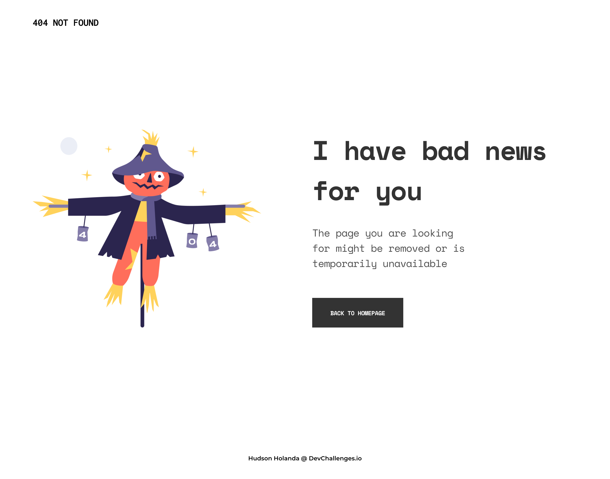

<p align="center">
  
</p>

<p align="center">
  
  
</p>

# Dev Challenges Responsive Web Developer Path - 404 Not Found

# :construction_worker: Installation

**You need to install [Node.js](https://nodejs.org/en/download/) i recommend that you use node js version 14 or [Yarn](https://yarnpkg.com/) first, then in order to clone the project via HTTPS, run this command:**

```
git clone https://github.com/lzhudson/dev-challenges-responsive-web-developer-path.git
```

SSH URLs provide access to a Git repository via SSH, a secure protocol. If you have a SSH key registered in your Github account, clone the project using this command:

```
git clone git@github.com:lzhudson/dev-challenges-responsive-web-developer-path.git
```

**Enter in folder**

```
cd 404-not-found
```


**Install dependencies**

```
yarn install
```

**Start development server**

```
yarn start
```

**Access in your browser http://localhost:3000**
